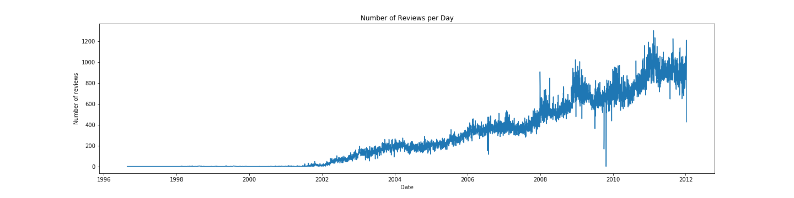

# Progress Report: Capstone Check-in 3

## Brewery Recommender
### Data Preprocessing
I am building a recommender system to figure out the most similar <em>brewery</em> based on a users overall beer ratings (0-5 scale). I hope to build another recommender model before the December deadline recommending specific <em>beers</em> for a user based on style preferences alone. I have been primarily working with a historical [dataset from BeerAdvocate](https://www.kaggle.com/rdoume/beerreviews) from 1997-2011 consisting of over 1.5 million beer review entries. 

It's clear to see in this image however, that the reviews do not really begin populating until around 2002. I decided since the data were so large that I would drop everything before 2002 so the reviews per day graph with the new data looks like this:

I started to notice when building my recommender that beers that only had 1 review were returning a pairwise distance value of 0 <em>exactly</em>. I decided since these beers were non-informative and messing up my recommender I would drop all beers with only 1 review. There were 18,850 beers with only 1 review in the full dataset so dropping these only accounted for losing about 1.2% of the data. I was also curious about what beers were rated the most in the data to see if these beers would be recommended more or less often:

I also dropped all beers that had no brewery name or username associated with them because I need both of these in my recommender model. Finally I created a smaller dataset that contained all columns from the original dataset with the dropped values removed, and only the review score, username, beer name, and the brewery names were kept in order to save memory when creating the recommender.

### Recommender Building
I built my recommender using the overall beer rating and that particular beer. I passed these into a pivot table and then determined the pairwise distances between the beers using cosine similarity. A major problem I am running into is the speed of this recommender because the recommender data frame takes up about 10.7GB of memory! I am currently looking for a way to reduce this memory size.

After getting my recommender dataframe using pairwise distances between the beers I then passed this into a function to score breweries using the similarity scores between beers. I created a random user to score any number of beers on a 0-5 uniform distribution scale. This user's beers were then each passed into the recommender and the most similar beers were kept. These similar beers were then passed back into the dataframe to determine where the beers came from (i.e. what brewery they exist at). Then I took the mean of the similarity scores for the breweries and sorted these breweries by the most similar. The end result for a user with 50 beers looks like the following right now:

## Beer Recommender
- Although I have not made progress on the beer recommender model I hope to gather data from RateBeer and OpenBrewerydb to find 