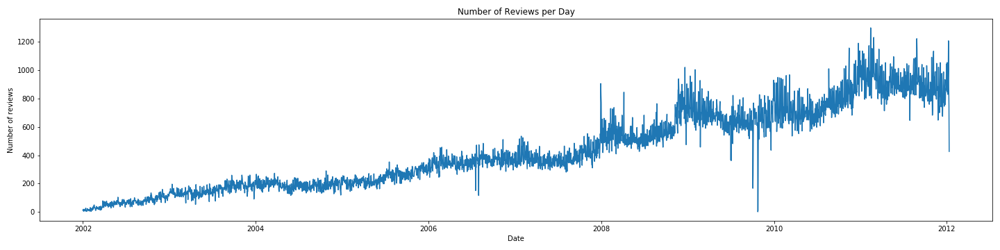

# Progress Report: Capstone Check-in 3

## Problem Overview:
### Brewery Recommender:

I am building a recommender system to figure out the most similar <em>brewery</em> based on a users overall beer ratings (0-5 scale). I hope to build another recommender model before the December deadline recommending specific <em>beers</em> for a user based on style preferences alone. I have been primarily working with a historical [dataset from BeerAdvocate](https://www.kaggle.com/rdoume/beerreviews) from 1997-2011 consisting of over 1.5 million beer review entries. 

It's clear to see in this image however, that the reviews do not really begin populating until around 2002. I decided since the data were so large that I would drop everything before 2002 so the reviews per day graph with the new data looks like this:

I started to notice when building my recommender that beers that only had 1 review were returning a pairwise distance value of 0 <em>exactly</em>. I decided since these beers were non-informative and messing up my recommender I would drop all beers with only 1 review. There were 18,850 beers with only 1 review in the full dataset so dropping these only accounted for losing about 1.2% of the data. I was also curious about what beers were rated the most in the data to see if these beers would be recommended more or less often:

### Beer Recommender:
- Although I have not made progress on the beer recommender model I hope to gather data from RateBeer and OpenBrewerydb to find 