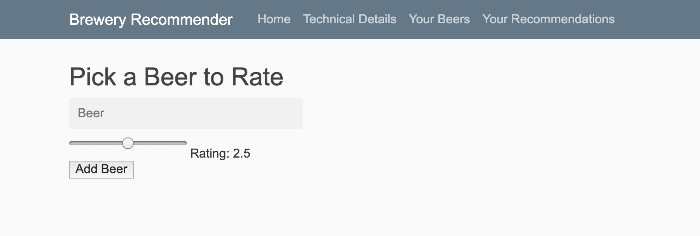
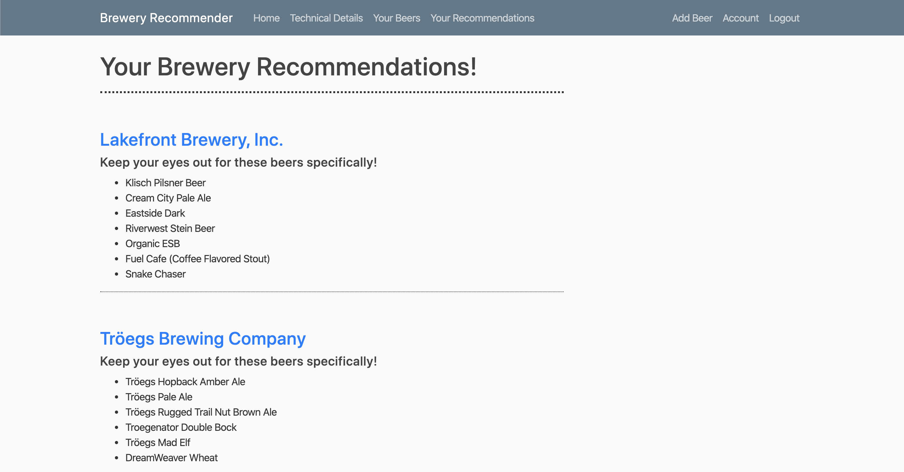

# Brewery Recommender

## Overview
I built a recommender system to figure out the most similar <em>brewery</em> based on a users overall beer ratings (0-5 scale).

### Workflow Summary
- Cleaning and visualizing the dataset
- Building recommender dataframe using pairwise-distances
  - Compressing recommender dataframe to save space and memory
- Building a function to aggregate similarity scores for each brewery
- Building a Flask App for Brewery recommendations
  - Create a database for users using SQLAlchemy
  - Run brewery recommender function underneath flask
  - Get recommendations!

### Cleaning and Visualizing Data
I worked with a historical [dataset from BeerAdvocate](https://www.kaggle.com/rdoume/beerreviews) that spanned from 1996-2011 consisting of over 1.5 million beer review entries. I ended up cleaning the data so that I was working with about 1.3 million entries when building my model.
 
I had to remove sparse entries from my data because they would skew my pair-wise distance calculations when getting brewery recommendations.

### Building Recommender
I built my recommender using the overall beer rating and that particular beer. I passed these into a pivot table and then determined the pairwise distances between the beers using cosine similarity. In order to save space I had to first convert all the `float64` values to `float16` values. The memory needed to store the recommender dataframe dropped from 10.7+GB to 2.7+GB when I did this. I then pickled my dataframe and zipped it to be able to upload it to Github.

### Aggregating Similarity Scores Function
After building my recommender dataframe with pairwise distances between the beers I then passed this into a function to score breweries using the similarity scores between beers. This function takes a user's rated beers and figures out which beers are the most similar. It then determines what brewery these beers exist at. Note here that pairwise-distances are scaled for the rating given by the user for each beer so that 5 has more positive weight than 4, and 1 has more negative weight than 2. After determining where each beer existed I then found the mean similarity score for each brewery and determined if there were any similar beers at each brewery (similar beers have a similarity score < 0.5). After this I then returned the most similar breweries (breweries with mean similarity scores < 0.75) with more than 1 similar beer to a dictionary.

### Flask App
#### Creating database for users in SQLAlchemy
I first had to create a database to allow users to add beers to their unique profile. I used SQLAlchemy and created classes for both the users and their posts.

#### Run brewery function underneath flask
I created the function in a `.py` file so that I could pass it in to the flask app and create recommendations based on the inputs in the unique user's database. As the user adds more beer to their database their recommendations will adjust and possibly change over time to account for their varied (or not) tastes.

#### Get recommendations
Right now the app is hosted locally, where users can login and either add new beers by going to this page:

 
 
After users select all their beers they can see their recommendations on this page:

Each of the breweries are hyperlinked to a Google search for that specific brewery.

### Future Implementations
- Allow users to find breweries in a specific area
- Give users the ability to add new beers to the complete database of beers
- Give users the ability to create a style profile to build a content based recommender model
