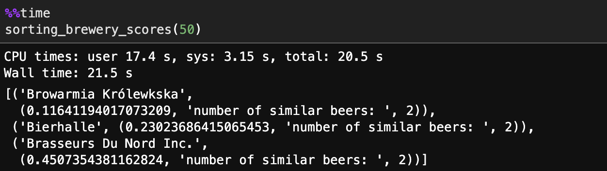

# Brewery Recommender

## Overview
I built a recommender system to figure out the most similar <em>brewery</em> based on a users overall beer ratings (0-5 scale).

### Workflow Summary
- Cleaning and visualizing the dataset
- Building recommender dataframe using pairwise-distances
- Compressing recommender dataframe to save space and memory
-

### Cleaning and Visualizing Data
I worked with a historical [dataset from BeerAdvocate](https://www.kaggle.com/rdoume/beerreviews) that spanned from 1996-2011 consisting of over 1.5 million beer review entries. I ended up cleaning the data so that I was working with about 1.3 million entries when building my model.
 
I had to remove sparse entries from my data because they would skew my pair-wise distance calculations when getting brewery recommendations.

### Building Recommender
I built my recommender using the overall beer rating and that particular beer. I passed these into a pivot table and then determined the pairwise distances between the beers using cosine similarity. In order to save space I had to first convert all the `float64` values to `float16` values. The memory needed to store the recommender dataframe dropped from 10.7+GB to 2.7+GB when I did this. I then pickled my dataframe and zipped it to be able to upload it to Github.

I looked into chunking the data but since I need access to all the beers at all times so I don't think this is going to work. Also, I don't think pickling my data will work since I will just read the data back in. Right now the main reduction in memory comes from dropping unnecessary columns from the original data set and converting my float64 values to float32. This reduced my data frame to take up only ...

- For the demo, I may just use a limit dataframe to increase the speed of the recommendation process.

After getting my recommender dataframe using pairwise distances between the beers I then passed this into a function to score breweries using the similarity scores between beers. To test this in the jupyter notebook I created a random user to score any number of beers on a 0-5 uniform distribution scale. This user's beers were then each passed into the recommender and the most similar beers were kept (right now I am just keeping the top 10 most similar to speed up the model). These similar beers were then passed back into the dataframe to determine where the beers came from (i.e. what brewery they exist at). Then I took the mean of the similarity scores for the breweries and sorted these breweries by the most similar. The end result for a user with 50 beers looks like the following right now:

### Flask App
I have made significant progress in building out a flask app for my final project. Right now the app is hosted locally, where a user will eventually be able to login or register to create an account. When the user goes to register for an account they will be prompted to rate the 10 most commonly rated beers (see chart above), leaving the ones they haven't had blank. Based on these preliminary ratings the recommender then prints out the 3 most similar breweries. My next goals are to have this printout look nicer on the screen and to also tell the user what the most similar beers are. The user input screen right now looks like this:

On this screen, the user can enter in any number, but my goal is to add a slider bar between 0 and 5. The recommendation are given on the next screen which looks like this:

With the similar beers at a brewery, you can see that I just tell the user how many similar beers are at a particular brewery not what those beers are. Similar beers are beers with similarity scores (pairwise distances) less than 0.5. It would be nice to know what those beers are and possibly where the user can buy them. Before the end of the project, I will be adding functionality with GoogleMapsAPI where I will give them the option to map to the breweries or even to where the user can buy the most similar beers. I also want to look at twitter data to find any trends in popularity surrounding breweries in a particular area., but I'm not sure if this is going to work because twitter data isn't always that easy to work with. Currently, I used the #brewery hashtag to look for any trends in specific areas. After some more cleaning, I may be able to return more useful results for looking at "trending" breweries in a geographic location.

Right now the flask app

## Beer Style Recommender
Although I have not made progress on the beer recommender model I hope to gather data from RateBeer and OpenBrewerydb to build a recommender based on the style of someone's beer profile rather than their overall rating. I hope to build another recommender model before the December deadline recommending specific <em>beers</em> for a user based on style preferences alone.
